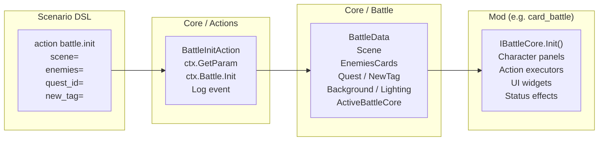

# Battle System

The battle engine is a pluggable, mod-driven system. Each battle ruleset is implemented as a mod (e.g. `card_battle`, `ff_battle`) following the `IBattleCore` interface. Battles are initiated from scenario scripts via `action battle.init`.

## Architecture overview



## Key interfaces

### `IBattleCore` — Combat ruleset

Every battle system mod defines a class implementing `IBattleCore`:

| Member | Description |
|---|---|
| `Id` | Unique string ID used by `battle.set_core` |
| `ActionProvider` | Returns `IActionExecutorProvider` for overriding action executors |
| `Init(Character[] playerChars, Character[] enemyChars, IBattleContext ctx)` | Called when battle starts — sets up UI, spawns enemies |
| `Start()` | Called after Init — begins the battle loop |

### `IActionExecutor` — Ability resolution

Each battle action type (attack, defence, stun, item, etc.) has an executor:

| Member | Description |
|---|---|
| `ActionId` | Unique action identifier |
| `Execute(action, user, target)` | Resolves the action against target |

Executors are registered through `ActionExecutorHub`, which routes actions by ID at runtime.

GDScript mods can register executors as well — a `.gd` file with `get_action_id()` + `execute(action, user, target)` is auto-registered into the global executor registry. See [GDScript in Mods](site/docs/mods/src/gdscript) for the full API.

### `IBattleContext` — Battle state

Provides read access to current battle participants, turn order, and active effects.

## Battle initialization flow

1. Scenario runs `action battle.set_core core=CardBattle` — selects ruleset
2. Scenario runs `action battle.init scene=... enemies=... quest_id=... new_tag=...`
3. `BattleInitAction` reads dialog variables, calls `BattleService.Init()`
4. `BattleData` captures current background and lighting state
5. `ModManager` resolves enemy character IDs to `Character` instances
6. Active `IBattleCore.Init()` is called — mod sets up its UI panels
7. `IBattleCore.Start()` begins the battle loop

**Important**: `battle.init` must run *after* the background has been set in the scenario, otherwise the battle gets a null backdrop.

## Status effects

Status effects (buff, debuff, stun) are applied during battle via the `StatusEffectQueue` on each character. Effects have a duration in turns and expire automatically.

See [Status Effects](../status_effects/) for the JSON definition format.

## Creating a custom battle system mod

1. Create a new mod with `manifest.json`:
```jsonc
   {
     "name": "MyBattle",                                   // Human-readable mod name
     "description": "Custom battle system",                // Short description
     "sources": ["src/**/*.cs"],                           // Glob patterns for C# source files
     "depends": ["core"]                                   // Versioned dependency strings
   }
```

2. Implement `IBattleCore`:
   ```csharp
   public class MyBattleCore : IBattleCore
   {
       public string Id => "MyBattle";
       public IActionExecutorProvider ActionProvider => new MyActionProvider();

       public void Init(Character[] playerChars, Character[] enemyChars, IBattleContext ctx)
       {
           // Create enemy panels, character widgets, action buttons
       }

       public void Start()
       {
           // Begin turn loop
       }
   }
   ```

3. Implement `IActionExecutorProvider` to provide your action executors:
   ```csharp
   public class MyActionProvider : IActionExecutorProvider
   {
       public IActionExecutor GetExecutor(string actionId)
       {
           return actionId switch
           {
               "mybattle.attack" => new MyAttackExecutor(),
               "mybattle.defend" => new MyDefendExecutor(),
               _ => null
           };
       }
   }
   ```

4. In scenarios, select your core before initiating battle:
   ```scenario
   action battle.set_core core=MyBattle
   action battle.init scene=town_entry enemies=wolf_1
   ```

## Battle-related Godot scenes

| Path | Purpose |
|---|---|
| `scenes/battle/battle.tscn` | Main battle scene container |
| `scenes/battle/winground.tscn` | Victory screen overlay |
| `scenes/battle/deadground.tscn` | Defeat screen overlay |
| `scenes/battle/exp_report_card.tscn` | Experience/loot report |
