# Save System

The save system uses a mod-aware dispatch architecture. All game state — core and mod alike — lives in named slots inside `SavePackage.ModData`. The core writes its state into the reserved `"__core__"` slot; mods write into their own named slots via `IModSaveable`.

## Architecture

```mermaid
flowchart TD
    subgraph SaveFlow["Save Flow"]
        direction TB
        S1["Save()"] --> S2["Build '__core__' slot"]
        S1 --> S3["CollectSaveData()"]
        S2 --> S3b["Metadata, Time, Characters, ..."]
        S3 --> S4["For each mod:\npre-fill slot.Metadata\n&#40;ModId, ModName, ModVersion&#41;"]
        S4 --> S5["mod.OnSave&#40;slot&#41;"]
        S5 --> S5a["Mod writes:\nMinCoreVersion, IsRequired, Data[...]"]
        S3b --> S6["Merge + Serialise"]
        S5a --> S6
    end

    subgraph LoadFlow["Load Flow"]
        direction TB
        L1["Load()"] --> L2["Validate all ModData slots"]
        L2 --> L2a["IsRequired mod installed?"]
        L2 --> L2b["CoreVersion >= MinCoreVersion?"]
        L2 --> L2c["ModVersion comparison\n&#40;downgrade/migration&#41;"]
        L2a --> L3{"Pass?"}
        L2b --> L3
        L2c --> L3
        L3 -->|yes| L4["Restore core state\nfrom '__core__'"]
        L3 -->|no| LErr["Abort"]
        L4 --> L5["DispatchLoad() → mods"]
        L5 --> L6["mod.OnLoad&#40;slot, out error&#41;"]
        L6 --> L6a["Read slot.Data[...]"]
        L6 --> L6b["Check blob.Version"]
        L6 --> L6c["Migrate if needed"]
    end

    S6 -->|writes| SavePkg["SavePackage\nModData dict"]
    SavePkg -->|reads| L1
```



## Core concepts

### Uniform slots

Every piece of persisted state lives in a `ModSlot` under `SavePackage.ModData`. There is no distinction between "core" and "mod" data at the storage level — the core just happens to own the reserved key `"__core__"`.

### Dispatcher (core)

The core is a lightweight dispatcher. It:
- Builds its own `"__core__"` slot with named `DataBlob` blocks per subsystem.
- Collects slots from mods and merges them into the save package.
- Validates mod metadata on load (required mods present, version compatibility).
- **Never inspects mod data contents** — it works only with byte arrays and version numbers.

## Save file structure (SavePackage)

| Field | Type | Description |
|---|---|---|
| `SaveId` | `string` | User-facing save name (e.g. "slot_1") |
| `Timestamp` | `DateTime` | UTC timestamp when the save was created |
| `CoreVersion` | `string` | Version of the game core that created this save |
| `ModData` | `Dict<string, ModSlot>` | Data slots from core + all mods |

## `"__core__"` slot structure

The core slot uses these blob keys:

| Blob key | Content type | Description |
|---|---|---|
| `Time` | `long` | In-game clock tick (minutes elapsed) |
| `Lamp` | key-value | `Radius` (float), `Influence` (float) |
| `Characters` | `List<CharacterInfoData>` | Recruited character snapshots |
| `Quests` | `List<QuestBase>` | Quest instances with progress |
| `Recruits` | `List<Recruit>` | Recruiting entries |
| `BattleSet` | `List<string>` | Active battle party character IDs |
| `Inventory` | `List<CItem>` | Inventory item stacks |
| `Recipes` | `List<string>` | Unlocked recipe IDs |
| `ActionPool` | `List<string>` | Persistent action card pool IDs |
| `CompletedScenarios` | `List<string>` | One-shot scenario IDs already run |

Slot preview metadata (`CurrentSceneName`, `GameTime`, `CharacterCount`) is stored in `ModMetadata.CustomData` as a JSON object, so the slot list UI can read it without deserialising game-state blobs.

## ModSlot

| Field | Type | Description |
|---|---|---|
| `Metadata` | `ModMetadata` | Structured metadata for core validation |
| `Data` | `Dict<string, DataBlob>` | Named data blocks defined by the mod |

## ModMetadata

The core pre-fills `ModId`, `ModName`, and `ModVersion` from `IModInfo` before calling `OnSave`. The mod only needs to set `MinCoreVersion`, `IsRequired`, `CustomData`, and the data blobs.

| Field | Type | Set by | Description |
|---|---|---|---|
| `ModId` | `string` | core | Mod ID (from `IModInfo.Id`) |
| `ModName` | `string` | core | Human-readable name (from `IModInfo.DisplayTitle`) |
| `ModVersion` | `string` | core | Version of the installed mod (from `IModInfo.Version`, read from `manifest.json`) |
| `MinCoreVersion` | `string` | mod | Minimum core version required |
| `IsRequired` | `bool` | mod | If true, save cannot load without this mod (default: true) |
| `CustomData` | `string` | mod | Free-form JSON for extra metadata |

## DataBlob

A versioned byte container with three access modes:

| Mode | Methods | Use case |
|---|---|---|
| **Key-value** | `GetInt/SetInt`, `GetFloat/SetFloat`, `GetString/SetString`, `GetBool/SetBool` | Simple fields like HP, mana, lamp radius |
| **JSON** | `ReadJson<T>()`, `WriteJson<T>(data)` | Complex objects with versioned schemas |
| **Binary** | `GetBytes()`, `SetBytes(byte[])` | Raw data (textures, compressed payloads) |

Key-value and JSON modes conflict — calling `WriteJson` overwrites the internal dictionary, and calling `SetInt` after `WriteJson` replaces the JSON object with a dictionary. Choose one mode per blob.

### DataBlob constructors

```csharp
new DataBlob();                          // version=1, empty
new DataBlob(version: 2);               // version=2, empty
new DataBlob(version: 2, myObject);      // version=2, serialises myObject as JSON byte payload
new DataBlob(rawBytes);                  // version=1, stores raw bytes
```

## Load flow (three phases)

1. **Phase 1 — Validation** (via `ModMetadata` of every slot):
   - For each `ModSlot` in `ModData`:
     - If `IsRequired == true` and the mod is not installed → **abort**.
     - If `CoreVersion < MinCoreVersion` → **abort**.
     - **Mod version comparison** (if both save and installed mod have versions):
       - `save.Version > installed.Version` → **abort** (downgrade not supported).
       - `save.Version < installed.Version` → **warning** (mod must handle migration in `OnLoad`).
2. **Phase 2 — Core state restore**: read blobs from `ModData["__core__"]` and push values into `RuntimeData`.
3. **Phase 3 — Mod dispatch** (`ModSaveableRegistry.DispatchLoad`):
   - For each installed mod whose ID is in `ModData` (excluding `"__core__"`), call `OnLoad(slot, out error)`.
   - Two overloads supported: `bool OnLoad(ModSlot, out string)` and legacy `void OnLoadVoid(ModSlot)` (throw on error).

## Reserved slot key

The key `"__core__"` is reserved for the core game state. If a mod attempts to write a slot with this key, the save service logs a warning and skips it.

## Implementing IModSaveable in a mod

Your mod must provide a class implementing `IModSaveable`. It is auto-discovered via reflection when your mod assembly loads.

### API

```csharp
public interface IModSaveable
{
    // Called on save. Slot metadata (ModId, ModName, ModVersion) is
    // already filled by the core. Set MinCoreVersion, IsRequired,
    // CustomData, and write Data[...].
    void OnSave(ModSlot slot);

    // Preferred: explicit contract. Return false + error message on
    // failure. Default impl calls OnLoadVoid for backward compat.
    bool OnLoad(ModSlot slot, out string errorMessage);

    // Legacy: throw-based error handling. Override instead of OnLoad
    // if you prefer exceptions for error reporting.
    void OnLoadVoid(ModSlot slot);
}
```

### Minimal example

```csharp
using Cthangover.Core.Mods;
using Cthangover.Core.Settings;

public class MyModSaveHandler : IModSaveable
{
    public void OnSave(ModSlot slot)
    {
        // ModId, ModName, ModVersion already set by core.
        // Set only what the core needs for validation:
        slot.Metadata.IsRequired = true;

        var blob = new DataBlob();
        blob.SetInt("Health", player.Health);
        blob.SetInt("Mana",   player.Mana);
        blob.SetString("Name", player.Name);

        slot.Data["Stats"] = blob;
    }

    public bool OnLoad(ModSlot slot, out string errorMessage)
    {
        if (slot.Data.TryGetValue("Stats", out var blob))
        {
            player.Health = blob.GetInt("Health", 100);
            player.Mana   = blob.GetInt("Mana", 50);
            player.Name   = blob.GetString("Name", "Hero");
            errorMessage = null;
            return true;
        }

        errorMessage = null;
        return true; // No data → nothing to restore, not an error
    }
}
```

### Versioned migration

When your data schema changes, use `DataBlob.Version` to handle migration:

```csharp
public void OnSave(ModSlot slot)
{
    var data = new PlayerStateV2 { Health = 80, Mana = 40, Stamina = 100 };
    slot.Data["FullState"] = new DataBlob(version: 2, data);
}

public bool OnLoad(ModSlot slot, out string errorMessage)
{
    if (!slot.Data.TryGetValue("FullState", out var blob))
    {
        errorMessage = null;
        return true; // no data — nothing to restore
    }

    if (blob.Version == 2)
    {
        var state = blob.ReadJson<PlayerStateV2>();
        Apply(state);
        errorMessage = null;
        return true;
    }

    if (blob.Version == 1)
    {
        var old = blob.ReadJson<PlayerStateV1>();
        Apply(new PlayerStateV2
        {
            Health  = old.Health,
            Mana    = old.Mana,
            Stamina = 100, // default for new field
        });
        errorMessage = null;
        return true;
    }

    errorMessage = $"Unsupported data version: {blob.Version}";
    return false;
}
```

### Binary data (textures)

```csharp
public void OnSave(ModSlot slot)
{
    slot.Data["Skin"] = new DataBlob(textureBytes);
}

public bool OnLoad(ModSlot slot, out string errorMessage)
{
    if (slot.Data.TryGetValue("Skin", out var blob))
    {
        var tex = Texture2D.LoadFromRaw(blob.GetBytes());
        ApplySkin(tex);
    }

    errorMessage = null;
    return true;
}
```

### Marking a mod as optional

If a save can be loaded without your mod, set `IsRequired = false`:

```csharp
slot.Metadata.IsRequired = false;
```

The core will log a warning and skip the mod's data if the mod is not installed.

### Compatibility guard (MinCoreVersion)

If your save data depends on a specific core API, set the minimum version:

```csharp
slot.Metadata.MinCoreVersion = "0.2.0";
```

On load, if the current core version is below `0.2.0`, the load is aborted with an error message.

## Save slot API (SaveService)

| Method | Description |
|---|---|
| `Save(string fileName)` | Build `"__core__"` slot, collect mod slots, write JSON |
| `Load(string fileName) : bool` | Deserialize, validate + restore + dispatch |
| `GetSaveSlots(int slotCount) : List<SaveSlotInfo>` | Enumerate slots with preview metadata |
| `DeleteSave(string fileName)` | Delete JSON + PNG screenshot |

## Backward compatibility

Old saves (without `ModData`, `SaveId`, `Timestamp`, `CoreVersion` fields) will fail to load because the `"__core__"` slot is required. The old `SaveData` format must be migrated manually or via a one-time converter tool.

## Version comparison

During phase-1 validation the core compares `ModMetadata.ModVersion` from the save with `IModInfo.Version` from the installed mod. Both values originate from the `"version"` field in `manifest.json`.

### Comparison strategy

The core uses **semver-first, string-fallback** via `VersionHelper.Compare`:

1. If both strings parse as `System.Version` (`major.minor[.build[.revision]]`), compare numerically. This handles `"1.0" < "2.0"`, `"9.0" < "10.0"`, etc.
2. Otherwise, fall back to ordinal string comparison (`String.CompareOrdinal`). Works for free-form tags like `"Enigma1.5"`, `"alpha-3"`, `"beta-1"`, `"v2"`.

### Supported version formats

| Format | Example | Type |
|---|---|---|
| Strict semver | `1.0.0`, `2.5.3.1` | Numeric |
| Short semver | `1.0`, `0.1` | Numeric |
| Letter in version | `1b.2.0`, `1c.0.1` | Numeric (parsed by `Version`) |
| Prefixed tags | `v1`, `v2.0` | String fallback |
| Codename-style | `Enigma1.5`, `Enigma2.0` | String fallback |
| Alpha/beta tags | `alpha-1`, `beta-3` | String fallback |

### Validation rules

| Condition | Result |
|---|---|
| No version in save or installed mod | Skip check |
| `save.Version > installed.Version` | **Abort** — save was made by a newer mod; downgrade not supported |
| `save.Version < installed.Version` | **Warning** — save is from an older mod version; the mod must handle migration in `OnLoad` |
| `save.Version == installed.Version` | OK |

## Adding version to manifest.json

Every mod's `manifest.json` must include a semver version string:

```json
{
  "name": "My Mod",
  "version": "1.0.0",
  "author": "...",
  "description": "...",
  "sources": ["src/**/*.cs"]
}
```

This value flows through `ModManifest.Version` → `IModInfo.Version` → `ModMetadata.ModVersion` and is used for the save-system version checks above.

## Important rules for mod authors

- **Add `"version"` to `manifest.json`** — the core uses it for save validation and migration detection.
- **One `IModSaveable` per mod** — create a single implementation in your assembly.
- **Never set `ModId`, `ModName`, or `ModVersion`** — the core pre-fills them. Set `MinCoreVersion`, `IsRequired`, `CustomData`, and `Data`.
- **Prefer `bool OnLoad(ModSlot, out string)`** — explicit contract, no exceptions. Override `OnLoadVoid` only for legacy/compatibility.
- **Mods must not depend on each other's save data** — the dispatch order is undefined.
- **Version your `DataBlob` blocks** — use separate blobs per logical entity, version each independently.
- **Handle missing keys** — use `TryGetValue` and provide defaults.
