# Save System

The save system uses a mod-aware dispatch architecture. All game state — core and mod alike — lives in named slots inside `SavePackage.ModData`. The core writes its state into the reserved `"__core__"` slot; mods write into their own named slots via `IModSaveable`.

## Architecture

```mermaid
flowchart TD
    subgraph SaveFlow["Save Flow"]
        direction TB
        S1["Save()"] --> S2["Build '__core__' slot"]
        S1 --> S3["CollectSaveData()"]
        S2 --> S3b["Metadata, Time, Characters, ..."]
        S3 --> S4["For each mod:\npre-fill slot.Metadata\n&#40;ModId, ModName, ModVersion&#41;"]
        S4 --> S5["mod.OnSave&#40;slot&#41;"]
        S5 --> S5a["Mod writes:\nMinCoreVersion, IsRequired, Data[...]"]
        S3b --> S6["Merge + Serialise"]
        S5a --> S6
    end

    subgraph LoadFlow["Load Flow"]
        direction TB
        L1["Load()"] --> L2["Validate all ModData slots"]
        L2 --> L2a["IsRequired mod installed?"]
        L2 --> L2b["CoreVersion >= MinCoreVersion?"]
        L2 --> L2c["ModVersion comparison\n&#40;downgrade/migration&#41;"]
        L2a --> L3{"Pass?"}
        L2b --> L3
        L2c --> L3
        L3 -->|yes| L4["Restore core state\nfrom '__core__'"]
        L3 -->|no| LErr["Abort"]
        L4 --> L5["DispatchLoad() → mods"]
        L5 --> L6["mod.OnLoad&#40;slot, out error&#41;"]
        L6 --> L6a["Read slot.Data[...]"]
        L6 --> L6b["Check blob.Version"]
        L6 --> L6c["Migrate if needed"]
    end

    S6 -->|writes| SavePkg["SavePackage\nModData dict"]
    SavePkg -->|reads| L1
```

## Core concepts

### Uniform slots

Every piece of persisted state lives in a `ModSlot` under `SavePackage.ModData`. There is no distinction between "core" and "mod" data at the storage level — the core just happens to own the reserved key `"__core__"`.

### Dispatcher (core)

The core is a lightweight dispatcher. It:
- Builds its own `"__core__"` slot with named `DataBlob` blocks per subsystem.
- Collects slots from mods and merges them into the save package.
- Validates mod metadata on load (required mods present, version compatibility).
- **Never inspects mod data contents** — it works only with byte arrays and version numbers.

## Load flow (three phases)

1. **Phase 1 — Validation** (via `ModMetadata` of every slot):
   - For each `ModSlot` in `ModData`:
     - If `IsRequired == true` and the mod is not installed → **abort**.
     - If `CoreVersion < MinCoreVersion` → **abort**.
     - **Mod version comparison** (if both save and installed mod have versions):
       - `save.Version > installed.Version` → **abort** (downgrade not supported).
       - `save.Version < installed.Version` → **warning** (mod must handle migration in `OnLoad`).
2. **Phase 2 — Core state restore**: read blobs from `ModData["__core__"]` and push values into `RuntimeData`.
3. **Phase 3 — Mod dispatch** (`ModSaveableRegistry.DispatchLoad`):
   - For each installed mod whose ID is in `ModData` (excluding `"__core__"`), call `OnLoad(slot, out error)`.
   - Two overloads supported: `bool OnLoad(ModSlot, out string)` and legacy `void OnLoadVoid(ModSlot)` (throw on error).

## Reserved slot key

The key `"__core__"` is reserved for the core game state. If a mod attempts to write a slot with this key, the save service logs a warning and skips it.

## Pages

- [Data Model](data-model.md) — SavePackage, __core__ slot, ModSlot, ModMetadata, DataBlob
- [Mod API](api.md) — IModSaveable interface, examples, SaveService
- [Versioning & Compatibility](versioning.md) — version comparison, backward compatibility, rules
