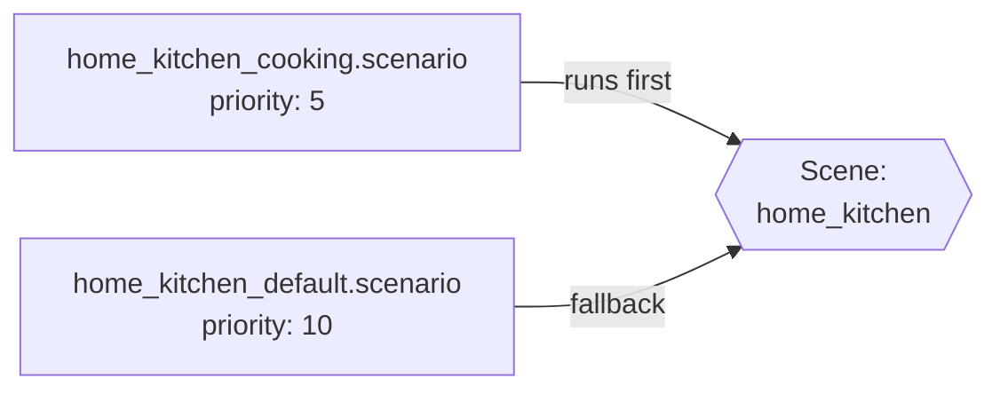

# Scenes

Scene definitions map scene IDs to default backgrounds, ambient music, and entry-point scenarios. Scenes are the navigation graph of the game — the player moves between them.

## JSON structure

```jsonc
{
  "name": "scene_id",                                       // Unique scene identifier (referenced by switch_scene)
  "defaultBackground": "path/to/background",                // Path to background image loaded on scene enter (or array of paths)
  "defaultAmbient": "playlist_id",                          // Playlist ID for background music (empty = no music)
  "defaultScenario": "scenarios/path/to/default.scenario"   // Scenario file that runs when the scene loads
}
```

## Field reference

| Field | Description |
|---|---|
| `name` | Unique scene identifier (e.g. `home_kitchen`, `town_entry`). Referenced by `switch_scene` in DSL |
| `defaultBackground` | Path to the background image loaded on scene enter (relative to `backgrounds/`). Can be a single string or an array of strings for multiple backgrounds |
| `defaultAmbient` | Playlist ID for background music (from `music/playlists/`). Empty string = no music |
| `defaultScenario` | Path to the scenario file that runs when the scene loads (relative to mod root) |

## Real examples

From `mods/core/scenes/`:

```jsonc
{
  "name": "home_kitchen",                                 // Scene ID — used with switch_scene and subscriptions
  "defaultBackground": "home/kitchen",                    // Background image path (relative to backgrounds/)
  "defaultAmbient": "",                                   // No ambient music for this scene
  "defaultScenario": "scenarios/home/home_kitchen_default.scenario"  // Entry-point scenario
}
```

```jsonc
{
  "name": "home_vestibule",                                   // Scene ID — vestibule/entrance of the player's home
  "defaultBackground": "home/vestibule",                      // Background image path (relative to backgrounds/)
  "defaultAmbient": "",                                       // No ambient music for this scene
  "defaultScenario": "scenarios/home/home_vestibule_default.scenario"  // Entry-point scenario
}
```

## Scene navigation

Scenes are connected through the `switch_scene` DSL command:

```scenario
switch_scene home_vestibule
end
```

And through `option` jumps that lead to `switch_scene`:

```scenario
select "[Where to?]" key=home_outside/prompt
option "Enter the house" key=home_outside/opt_enter -> :enter
option "To the town" key=home_outside/opt_town -> :town

:enter
switch_scene home_vestibule
end

:town
switch_scene town_entry
end
```

## Scene lifecycle

When the player enters a scene, the engine:

1. Loads `defaultBackground` as the background image
2. Starts `defaultAmbient` playlist (if set)
3. Loads and executes `defaultScenario`
4. Fires `on_enter` subscriptions from all mods (by `priority` order)
5. When leaving, fires `on_exit` subscriptions

## Mod subscriptions to scenes

Mods hook into scene lifecycle via their `manifest.json`:

```jsonc
{
  "subscriptions": [
    {
      "scene": "home_kitchen",      // Target scene ID to hook into
      "template": "default",        // Wrapper template name (from wrappers/ directory)
      "code": "cooking_panel_init", // C# code fragment name (from subscriptions/{name}.cs)
      "trigger": "on_enter",        // Lifecycle event: on_enter or on_exit
      "priority": 10                // Execution order (lower = earlier); multiple mods sorted by priority
    },
    {
      "scene": "home_kitchen",
      "template": "default",
      "code": "dinner_tools_hide",
      "trigger": "on_exit",
      "priority": 10
    }
  ]
}
```

Multiple mods can subscribe to the same scene — they run in priority order. This is how the Cooking mod adds a "Cook" option to the kitchen scene without modifying `core`.

## Scenario priority system

Multiple `.scenario` files can target the same `scene:`. The one with the **lowest** `priority` number runs first. If that scenario's `condition:` is unmet, the next-highest priority scenario is tried.



This allows mods to extend scenes non-destructively by writing additional scenario files with lower priority numbers.

## Adding a new scene

1. Create `scenes/{name}.json` with background, playlist, and default scenario
2. Create the background image(s) in `backgrounds/{name}/`
3. Write the default scenario in `scenarios/{path}.scenario`
4. Add `switch_scene {name}` commands to an existing scene to create a navigation path
5. Register `on_enter`/`on_exit` subscriptions in your manifest if needed
