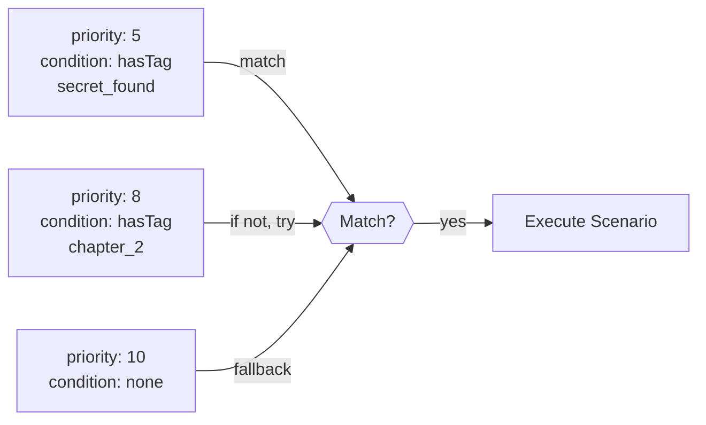

# Conditions — Quest Expression Language

The `condition:` metadata field uses a simple expression language to control which scenarios execute based on quest state and scene flags.

## Syntax

```scenario
condition: QuestId.method("arg") [&& || ! expr ...]
```

## Available methods

| Method | Description |
|---|---|
| `hasTag("tag")` | True if the quest has the specified tag |
| `notHasTag("tag")` | True if the quest does NOT have the tag |
| `IsActive` | True when quest Status equals `Progress` |
| `Status >= N` | True if quest Status is N or higher |
| `Status == N` | True if quest Status equals N |
| `Status < N` | True if quest Status is less than N |
| `DataStatus >= N` | True if quest numeric counter is N or higher |
| `DataStatus == N` | True if quest numeric counter equals N |

## Custom GDScript conditions

Mods can add custom condition names via GDScript. A GDScript with `get_condition_name()` + `evaluate(flags, args)` is auto-registered into the condition parser.

`scripts/weather_conditions.gd`:
```gdscript
extends RefCounted

func get_condition_name():
    return "gds.is_rain"

func evaluate(flags, args):
    return flags.get("weather", "") == "rain"
```

Usage in scenario:
```scenario
condition: gds.is_rain
```

With arguments:
```gdscript
func get_condition_name():
    return "gds.flag_equals"

func evaluate(flags, args):
    var expected = args.get("0", "")
    return flags.get("custom_flag", "") == expected
```

```scenario
condition: gds.flag_equals("victory")
```

GDScript conditions take priority over the built-in `QuestParser` — so `gds.is_rain` is resolved as a condition, not as a quest expression. See [GDScript in Mods](site/docs/mods/src/gdscript) for details.

## Flag conditions

Scene flags are evaluated directly — no `scene.` prefix needed:

```scenario
condition: door_unlocked == "true"
condition: counter >= 3
```

Flags are string or number key-value pairs set via the `set` DSL command or by action code.

## Operators

| Operator | Description |
|---|---|
| `&&` | Logical AND — both sides must be true |
| `\|\|` | Logical OR — at least one side must be true |
| `!` | Logical NOT — negates the following expression |
| `()` | Grouping for precedence |

## Real example — Murakami quest chain

```scenario
scene: town_entry
priority: 20
condition: MeetingMurakamiQuest.hasTag("wolf_battle") && MeetingMurakamiQuest.notHasTag("boss_battle")
---
background "town/meetingmurakami/00002-1920617752"
text "[Wolf tracks lead straight to the doorstep]" key=meeting/after_wolf/tracks
# ... scenario continues ...
```

This scenario only fires **after** the player fought the wolf but **before** they fought the boss. It's the middle chapter of a three-part quest.

## More complex examples

### Multiple quest dependencies

```scenario
condition: PrologQuest.hasTag("met_marao") && MeetingMurakamiQuest.hasTag("recruited")
```

Both conditions must be met.

### Either/or branching

```scenario
condition: PrologQuest.hasTag("found_book") || PrologQuest.hasTag("found_map")
```

Runs if the player found either the book OR the map.

### Negation with OR

```scenario
condition: !PrologQuest.hasTag("tutorial_done") && (PrologQuest.hasTag("woke_up") || PrologQuest.hasTag("in_alley"))
```

The tutorial hasn't been done yet, but the player has woken up or is in the alley.

### Status-based progression

```scenario
condition: PrologQuest.Status >= 2
```

Runs when PrologQuest reaches status 2 or higher.

### Using DataStatus for numeric progress

```scenario
condition: MainQuest.DataStatus >= 10
```

Runs when the quest's numeric progress counter reaches 10 or more.

### Combining quest conditions with flags

```scenario
condition: PrologQuest.hasTag("met_marao") && boss_battle == "done"
```

Runs when the prolog tag is set AND the scene flag `boss_battle` equals `"done"`.

## Condition evaluation order

1. Engine collects all scenarios for the current scene
2. Sorts by `priority` (ascending)
3. Evaluates each scenario's `condition:` in order
4. First scenario with a passing condition executes
5. If no condition passes, the lowest-priority scenario **without** a condition runs

This means:
- Put restrictive conditions on high-priority (low number) scenarios
- Put fallback scenarios at priority 10+ with no condition


