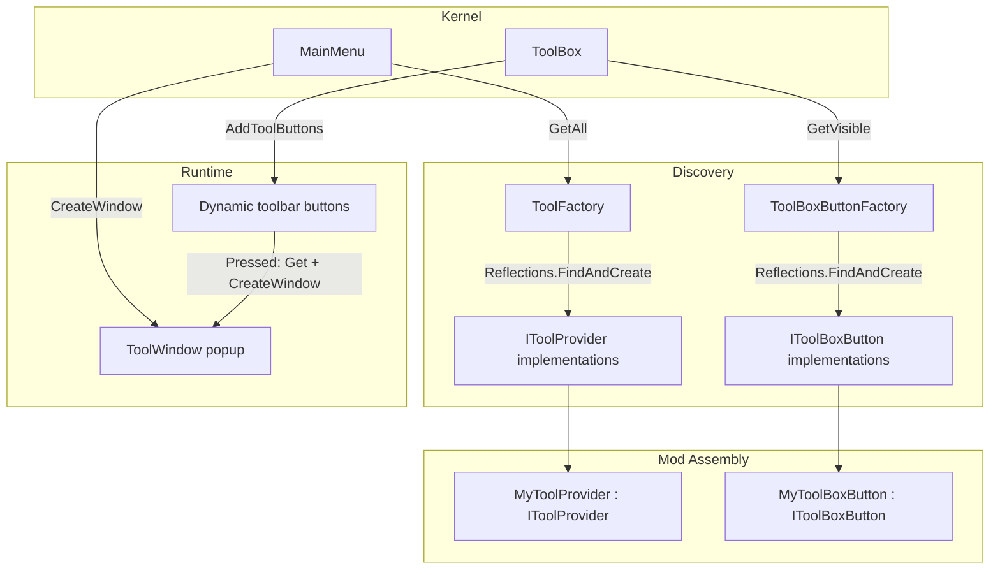

# Developer Tools

The developer tools system allows mods to create custom editor windows and register them in the in-game toolbar. Tools are discovered automatically via reflection, so any mod with C# code can contribute new tool windows without modifying the kernel.

## Architecture



Tools bootstrapping happens at startup:

1. `ToolFactory.Instance` scans all loaded assemblies for `IToolProvider` implementations via `Reflections.FindAndCreate`.
2. `ToolBoxButtonFactory.Instance` scans for `IToolBoxButton` implementations.
3. When a mod assembly loads (`ModAssemblyLoader`), both factories call `RegisterAssembly(assembly)` to discover mod-provided tools.
4. `MainMenu` populates a **Tools** dropdown from `ToolFactory.GetAll()`.
5. `ToolBox` dynamically creates HUD toolbar buttons from `ToolBoxButtonFactory.GetVisible()`.

## Core interfaces

### `IToolProvider`

The entry point for a custom tool. Every tool window must have a provider that implements this interface.

| Member | Type | Description |
|---|---|---|
| `Id` | `string` | Unique identifier used as the registry key (e.g. `"scenario_editor"`) |
| `LocaleKey` | `string` | Translation key for the tool's display name, resolved via `TranslationServer.Translate` |
| `CreateWindow()` | `Window` | Creates a new `Window` instance for this tool. The caller is responsible for adding it to the scene tree and displaying it |

### `IToolBoxButton`

Optional companion interface. Implement it alongside `IToolProvider` to add a persistent button on the in-game HUD toolbar that opens your tool.

| Member | Type | Description |
|---|---|---|
| `ToolId` | `string` | Matches an `IToolProvider.Id` in `ToolFactory`, wiring the button to a specific tool |
| `IconPath` | `string` | Resource path to the icon texture loaded for this button |
| `LocaleKey` | `string` | Translation key for the button's tooltip or accessible label |
| `IsVisible()` | `bool` | Return `false` to hide the button dynamically (e.g. dev-only buttons in release builds) |

## `ToolWindow` base class

Abstract base class for tool popup windows. Extends Godot's `Window`. Key features:

- **Dirty-state tracking** — `SetDirty()` / `MarkClean()` add/remove a `*` prefix on the title bar. On close with unsaved changes, a confirmation dialog appears automatically.
- **Confirmation dialogs** — `ShowUnsavedDialog(Action)` shows a localized "unsaved changes" prompt; `ConfirmDiscardUnsaved()` provides a return-value variant.
- **Layout helpers**:
  - `CreateFillContainer()` — full-anchor `VBoxContainer` filling the entire window
  - `CreateToolbar()` — pre-configured `HBoxContainer` with 8px spacing
  - `CreateSidebar(VBoxContainer, int width = 280)` — fixed-width `PanelContainer` with vertical scrolling
- **Monospace font** — `GetMonospaceFont()` resolves a monospace font for code displays, falling back to `ThemeDB.FallbackFont`.
- **Static openers** — `Open<T>()` (generic, parameterless constructor) and `ShowWindow(Window)` (for `IToolProvider`-created instances) center the window on screen.

## Registry

### `ToolFactory`

Singleton registry (`ToolFactory.Instance`) for `IToolProvider` implementations.

| Method | Description |
|---|---|
| `Register(IToolProvider)` | Adds a tool; duplicates by `Id` are silently ignored (first-wins) |
| `RegisterAssembly(Assembly)` | Scans an assembly for `IToolProvider` implementations and registers them — the primary hook for mods |
| `Get(string id)` | Looks up a tool by `Id`, returns `null` if not found |
| `GetAll()` | Returns all registered tools as a read-only list — used by `MainMenu` for the Tools dropdown |

Logging uses the `"TOOLS"` category.

### `ToolBoxButtonFactory`

Singleton registry (`ToolBoxButtonFactory.Instance`) for `IToolBoxButton` implementations.

| Method | Description |
|---|---|
| `Register(IToolBoxButton)` | Adds a button definition (duplicates not filtered — same `ToolId` may have different visibility rules) |
| `RegisterAssembly(Assembly)` | Scans an assembly for `IToolBoxButton` implementations — the primary hook for mods |
| `GetVisible()` | Returns all registered buttons that pass `IsVisible()`, used by `ToolBox.AddToolButtons` |

## HUD integration — `ToolBox`

The `ToolBox` control (`Core/UI/Tool/ToolBox.cs`) is the main toolbar/HUD container. It manages 5 built-in widgets:

- `MapWidget`
- `BagWidget` (inventory)
- `CharactersWidget` (character panel)
- `SkillWidget` (skills panel)
- `JournalWidget` (quest journal)

During `_Ready()`:

1. Built-in widget references are discovered via recursive tree search (`FindWidget<T>`).
2. Static buttons (Map, Bag, Characters, Skills, Settings, Journal) are wired.
3. `AddToolButtons(container)` dynamically creates `TextureButton` instances from `ToolBoxButtonFactory.GetVisible()` — each button opens its tool via `ToolFactory.Get(toolId).CreateWindow()`.

## Built-in tools

The `tools` mod provides four development tools:

| Tool ID | Description | Locale Key |
|---|---|---|
| `scenario_editor` | Full editor for `.scenario` DSL files — file tree, text/graph tabs, metadata inspection, background thumbnail previews, play-test mode | `tools/scenario_editor/title` |
| `scene_builder` | Interactive Godot scene inspector — wrapper template picker, live viewport with node hierarchy tree, C# code editor with compile-and-run | `tools/scene_builder/title` |
| `light_editor` | Edits static lights on backgrounds — light list (max 10), per-light radius/influence/color editors, draggable handles, shader preview, JSON export/import | `tools/light_editor/title` |
| `interactive_editor` | Creates/edits interactive object definitions — BG preview with draggable collider handles (rect, circle, polygon), JSON output, load/save to mod directories | `tools/interactive_editor/title` |

Each tool has a provider class (`ScenarioEditorToolProvider`, `SceneBuilderToolProvider`, `LightEditorToolProvider`, `InteractiveEditorToolProvider`) implementing `IToolProvider`, and a dedicated window class extending `ToolWindow`.

Two tools also provide `IToolBoxButton` implementations for quick access from the HUD toolbar:
- `LightEditorToolBoxButton` — always visible
- `InteractiveEditorToolBoxButton` — always visible

## Creating a custom tool

Implement a tool in your mod with three classes:

### 1. Provider — `IToolProvider`

```csharp
using Cthangover.Core.UI.Tool;
using Godot;

namespace MyMod
{
    public class MyToolProvider : IToolProvider
    {
        public string Id => "my_tool";
        public string LocaleKey => "tools/my_tool/title";
        public Window CreateWindow() => new MyToolWindow();
    }
}
```

### 2. Window — extends `ToolWindow`

```csharp
using Cthangover.Core.UI.Tool;
using Godot;

namespace MyMod
{
    public class MyToolWindow : ToolWindow
    {
        public MyToolWindow() : base("tools/my_tool/title")
        {
            var root = CreateFillContainer();
            AddChild(root);

            var toolbar = CreateToolbar();
            root.AddChild(toolbar);

            var closeBtn = new Button { Text = TranslationServer.Translate("tools/close") };
            closeBtn.Pressed += () => QueueFree();
            toolbar.AddChild(closeBtn);
        }
    }
}
```

### 3. Toolbar button (optional) — `IToolBoxButton`

```csharp
using Cthangover.Core.UI.Tool;

namespace MyMod
{
    public class MyToolBoxButton : IToolBoxButton
    {
        public string ToolId => "my_tool";
        public string IconPath => "";
        public string LocaleKey => "tools/my_tool/title";
        public bool IsVisible() => true;
    }
}
```

### 4. Add locale keys

In your mod's `locale/ui_en.properties`:

```properties
tools/my_tool/title = My Custom Tool
```

### Registration checklist

| Step | Action |
|---|---|
| 1 | Create provider class implementing `IToolProvider` with a unique `Id` |
| 2 | Create window class extending `ToolWindow` — use `CreateFillContainer`, `CreateToolbar`, etc. |
| 3 | (Optional) Create `IToolBoxButton` class for a persistent HUD button |
| 4 | Add locale keys in your mod's `locale/ui_en.properties` |
| 5 | Ensure your mod's `manifest.json` has `"sources"` covering the new `.cs` files |

The tool is auto-discovered — no manual registration needed. The provider and button classes are found via reflection when the mod assembly loads.

## Locale keys reference

Common UI locale keys used by the tool system:

| Key | Context |
|---|---|
| `tools/title` | Main menu "Tools" label |
| `tools/select_tool` | Tool selection dialog |
| `tools/launch` | Launch button |
| `tools/close` | Close button |
| `tools/unsaved_title` | Unsaved changes dialog title |
| `tools/unsaved_text` | Unsaved changes dialog body |

## Related

- [Source Code in Mods](mods/src/) — C# compilation and mod bootstrapping
- [Scene Builder](mods/src/#core-interfaces) — `IToolProvider` and `IToolBoxButton` interfaces
- [Scenes](mods/scenes/) — scene lifecycle and how scenes reference tools
- [Interactive Objects](mods/interactives/) — `interactive_editor` creates these definitions
- [Locale](mods/locale/) — `.properties` files for tool UI strings
